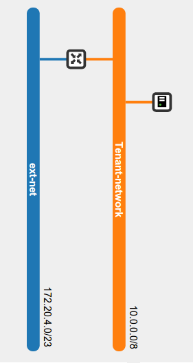
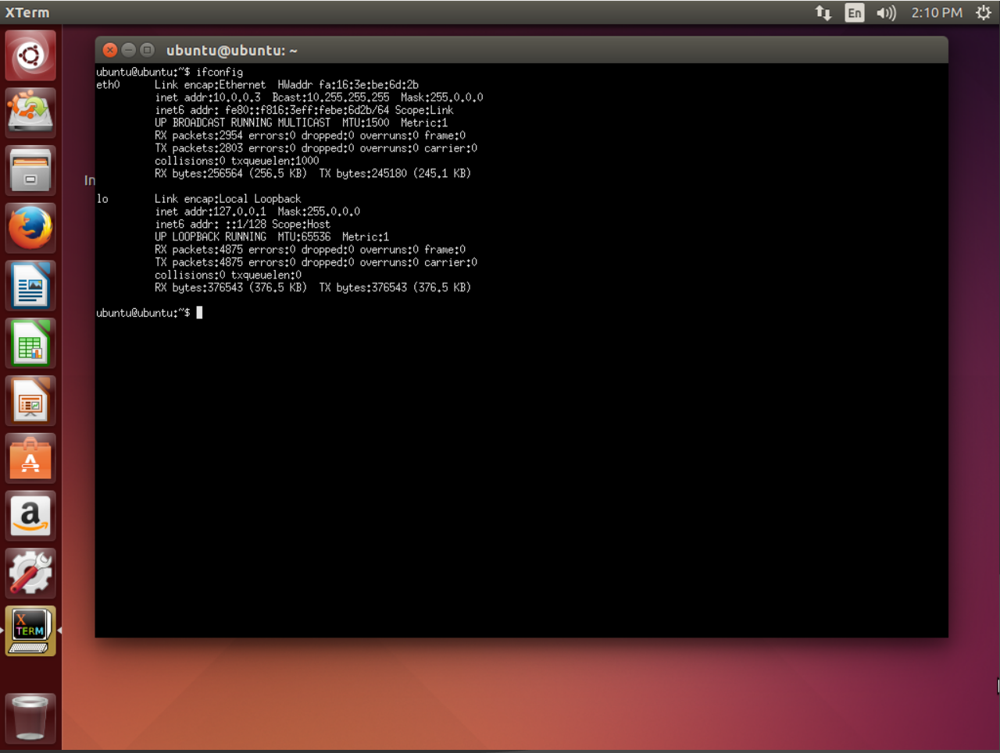
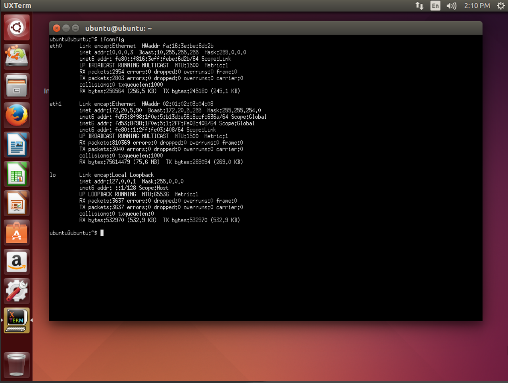

# SRIOV Installation on Ubuntu

This guide will wlk you throught the process of implementing the SRIOV function from Intel NIC based on Intel chipset 82576.

## Installation

### igb Installation

First, verify all the available network Controllers of the 82576 by:
	
	$ lspci | grep 82576

The expected results should be something similar to:

	06:00.0 Ethernet controller: Intel Corporation 82576 Gigabit Network Connection (rev 01)
	06:00.1 Ethernet controller: Intel Corporation 82576 Gigabit Network Connection (rev 01)
	08:00.0 Ethernet controller: Intel Corporation 82576 Gigabit Network Connection (rev 01)
	08:00.1 Ethernet controller: Intel Corporation 82576 Gigabit Network Connection (rev 01)

This result shows 4 different network controllers, as expected, because the driver used for this test is a Quad port NIC.

The second step is to verify the Driver Version by:

	$ ethtool -i eth0

The expected results should be something similar to:

	driver: igb
	version: 5.0.5-k
	firmware-version: 1.2.1
	bus-info: 0000:06:00.0
	supports-statistics: yes
	supports-test: yes
	supports-eeprom-access: yes
	supports-register-dump: yes

The version of the driver here is igb 5.0.5-k, but the latest version to this date is the 5.1.2 provided by Intel.

So download it by:
	
	$ wget http://downloadmirror.intel.com/13663/eng/igb-5.1.2.tar.gz

Then uncompress it:

	$ tar zxvf igb-5.1.2.tar.gz

Open the src folder and install it as sudo:

	$ make install

Now, to upgrade the actual driver runing in the NIC, the old one must be removed first, so:

	$ rmmod igb && modprobe igb

Now, if the driver version is verified by:

	$ ethtool -i eth0

The expected result should be:

	driver: igb
	version: 5.1.2
	firmware-version: 1.2.1
	bus-info: 0000:06:00.0
	supports-statistics: yes
	supports-test: yes
	supports-eeprom-access: yes
	supports-register-dump: yes

### igbvf Installation

The igbvf Driver provided by Intel in it website does *not* have support for Ubuntu, so the source code need some modifications.
First download the driver:

	$ wget http://downloadmirror.intel.com/18298/eng/igbvf-2.3.3.tar.gz

Uncompress the file:

	$ tar zxvf igbvf-2.3.3.tar.gz

And open src folser and edit the netdev.c file

Find line:

	__vlan_hwaccel_put_tag(skb, vid);

Substitute for:

	__vlan_hwaccel_put_tag(skb, htons(ETH_P_8021Q), vid);

Find:

	NETIF_F_HW_VLAN_RX |
	NETIF_F_HW_VLAN_TX |
	NETIF_F_HW_VLAN_FILTER;

Substitute for:

	NETIF_F_HW_VLAN_CTAG_RX |
	NETIF_F_HW_VLAN_CTAG_TX |
	NETIF_F_HW_VLAN_CTAG_FILTER;

Install the driver as sudo:

	$ make install

Now, to upgrade the actual driver runing in the Virtual Functions, the old one must be removed first, so:

	$ rmmod igbvf && modprobe igbvf

### Kernel Update

The igbvf driver is the igb driver for Virtual Functions, and it will be used by the Hypervisor. So, the kernel and it modules should ignore the igbvf driver so that the Hypervisor can use it.
To do it, you must edit or create, if it doesn't exist, the /etc/modprobe.d/blacklist-igbvf.conf: 

	$ nano /etc/modprobe.d/blacklist-igbvf.conf

and add the following line to it:
	
	blacklist igbvf

In order to create the Virtual functions automatically, the kernel must be informed to initialize them. This is done by editing or creating, if it doesn't exist, the /etc/modprobe.d/igb.conf:

	$ nano /etc/modprobe.d/igb.conf

and add the following line to it:

	options igb max_vfs=7

Now the kernel must be updated:

	$ update-initramfs -k all -t -u

And to initialize the IOMMU module in the kernel, the grub finle must be updated:

	$ nano /etc/default/grub

And some options must be added to the GRUB CMDLINE LINUX DEFAULT:

	GRUB_CMDLINE_LINUX_DEFAULT="quiet splash intel_iommu=on iommu=1 msi=1"

And to to update the gub:

	$ update-grub

Now reboot and check the Network Devices:

	$ lspci | grep 82576

Expected result should be similar toÇ

	06:00.0 Ethernet controller: Intel Corporation 82576 Gigabit Network Connection (rev 01)
	06:00.1 Ethernet controller: Intel Corporation 82576 Gigabit Network Connection (rev 01)
	07:10.0 Ethernet controller: Intel Corporation 82576 Virtual Function (rev 01)
	07:10.2 Ethernet controller: Intel Corporation 82576 Virtual Function (rev 01)
	07:10.4 Ethernet controller: Intel Corporation 82576 Virtual Function (rev 01)
	07:10.6 Ethernet controller: Intel Corporation 82576 Virtual Function (rev 01)
	07:11.0 Ethernet controller: Intel Corporation 82576 Virtual Function (rev 01)
	07:11.2 Ethernet controller: Intel Corporation 82576 Virtual Function (rev 01)
	07:11.4 Ethernet controller: Intel Corporation 82576 Virtual Function (rev 01)
	08:00.0 Ethernet controller: Intel Corporation 82576 Gigabit Network Connection (rev 01)
	08:00.1 Ethernet controller: Intel Corporation 82576 Gigabit Network Connection (rev 01)

### Configure KVM to use the functions in the VM`s

Again list the Network Devices:

	$ lspci | grep 82576

With and example result as:

	06:00.0 Ethernet controller: Intel Corporation 82576 Gigabit Network Connection (rev 01)
	06:00.1 Ethernet controller: Intel Corporation 82576 Gigabit Network Connection (rev 01)
	*07:10.0* Ethernet controller: Intel Corporation 82576 Virtual Function (rev 01)
	07:10.2 Ethernet controller: Intel Corporation 82576 Virtual Function (rev 01)
	07:10.4 Ethernet controller: Intel Corporation 82576 Virtual Function (rev 01)
	07:10.6 Ethernet controller: Intel Corporation 82576 Virtual Function (rev 01)
	07:11.0 Ethernet controller: Intel Corporation 82576 Virtual Function (rev 01)
	07:11.2 Ethernet controller: Intel Corporation 82576 Virtual Function (rev 01)
	07:11.4 Ethernet controller: Intel Corporation 82576 Virtual Function (rev 01)
	08:00.0 Ethernet controller: Intel Corporation 82576 Gigabit Network Connection (rev 01)
	08:00.1 Ethernet controller: Intel Corporation 82576 Gigabit Network Connection (rev 01)

Now use the number of the bus from one of the virtual functions 07:10.0

	$ virsh nodedev-list | grep pci

In the results should appear the related pci device of the virtual function listed above (07:10.0):

	pci_0000_00_00_0
	pci_0000_00_01_0
	pci_0000_00_01_1
	pci_0000_00_03_0
	pci_0000_00_03_2
	pci_0000_00_04_0
	pci_0000_00_04_1
	pci_0000_00_04_2
	pci_0000_00_04_3
	pci_0000_00_04_4
	pci_0000_00_04_5
	pci_0000_00_04_6
	pci_0000_00_04_7
	pci_0000_04_00_0
	pci_0000_05_02_0
	pci_0000_05_04_0
	pci_0000_06_00_0
	pci_0000_06_00_1
	*pci_0000_07_10_0*
	pci_0000_07_10_2
	pci_0000_07_10_4
	pci_0000_07_10_6
	pci_0000_07_11_0
	pci_0000_07_11_2
	pci_0000_07_11_4
	pci_0000_08_00_0
	pci_0000_08_00_1
	pci_0000_0a_00_0

The pci\_000\_07\_10\_0 listed above is the related device of the virtual function (07:10.0)
Now, to verify if this is actually the case:

	$ virsh nodedev-dumpxml pci_0000_07_10_0

The result will be something similar to:

	<device>
		<name>pci_0000_07_10_0</name>
		<path>/sys/devices/pci0000:00/0000:00:03.2/0000:04:00.0/0000:05:02.0/0000:07:10.0</path>
		<parent>pci_0000_05_02_0</parent>
		<driver>
			<name>igbvf</name>
		</driver>
		<capability type='pci'>
			<domain>0</domain>
			<bus>7</bus>
			<slot>16</slot>
			<function>0</function>
			<product id='0x10ca'>82576 Virtual Function</product>
			<vendor id='0x8086'>Intel Corporation</vendor>
			<capability type='phys_function'>
				<address domain='0x0000' bus='0x06' slot='0x00' function='0x0'/>
			</capability>
			<iommuGroup number='33'>
				<address domain='0x0000' bus='0x07' slot='0x10' function='0x0'/>
			</iommuGroup>
		</capability>
	</device>

Here we can verify that this is a Virtual function and that the driver is the igbvf.
From this result we need to store some information:

+   Domain: 0
+   Bus: 7
+   Slot: 16
+	Function: 0

Now we need to create a virtual device in XML so that the KVM can assign it to a guest.
For that, create a file:

	$ nano /tmp/new-interface.xml

And add the following data changing the values listed above:

	<interface type='hostdev' managed='yes'>
		<mac address='02:01:02:03:04:08'/>
		<source>
			<address type='pci' domain='0' bus='7' slot='16' function='0'/>
		</source>
	</interface>

Now, Choose a VM to assign the device, to list them use:

	$ virsh list

A common output would be:

	 Id    Name                           State
	----------------------------------------------------
	12    instance-0000001b              running
	13    instance-0000001c              running
	14    instance-0000001d              running

And assign the device by:

	$ virsh attach-device instance-0000001b /tmp/new-interface.xml --live --config

Where instance-0000001b is the choosen VM to attach the device and --config is used to make it permanent.

This may fail due to some Bugs in the Hypervisor, so you will need to bind the igbvf driver to the Virtual Funtions, by:

	$ modprobe igbvf

Now, redo the last command and it should works.

### Verify the Assigned device on the host

For this step we are going to use Ubuntu 14.04 as the guest. This guest will be connected in a tenant-network that has acess to the external netwrok throu the router, as shown in the next image:

First let's see the network devices without assigning the virtual function.

After boot it, check the network devices:

	$ ifconfig

The expected result should be similar to:

Then, assign the device by the procedure above and chack again the networks:

	$ ifconfig

The expected result should be similar to:

This image shows that the MAC Address given to the device in the XML file <mac address='02:01:02:03:04:08'/> is the one of the new interface eth1.
And also, it can be noted that the IP Address of this interface is not from the Tenant Network (10.0.0.0/8), it is from outside, from the actual NIC. So the SRIOV is functioning and bypassing the Neutron.

